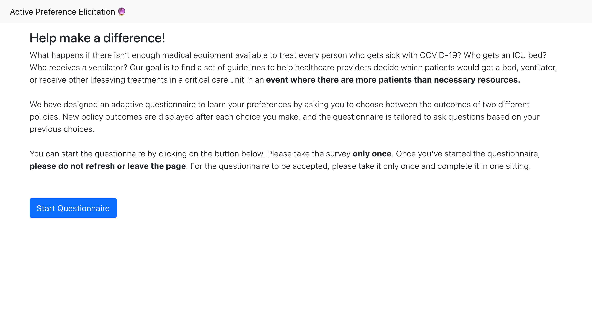
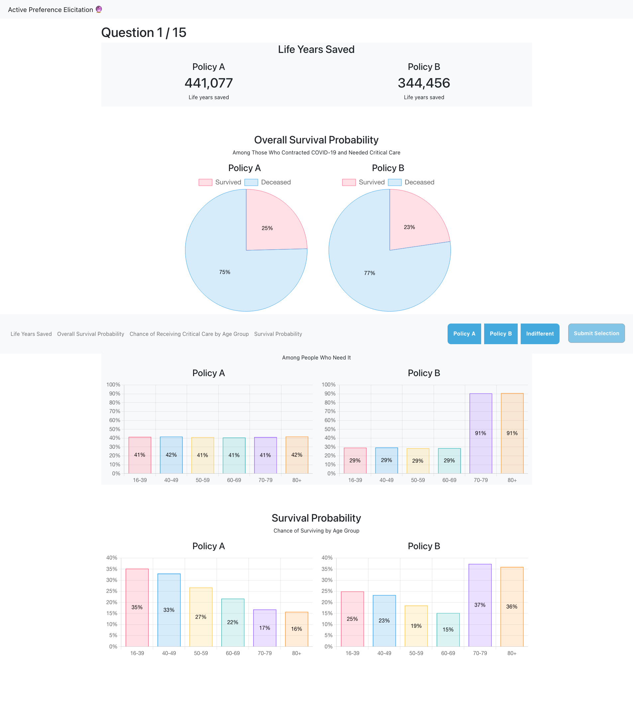

# Active Preference Elicitation Web App


This web app implements the active preference elicitation algorithm proposed in [Vayanos et al., 2021](https://arxiv.org/abs/2003.01899).

## Repository Structure
This project is a mono-repo in that it contains both the frontend and backend code needed to host the project. The backend uses the Django framework while the frontend uses the React framework.

## Getting Started

### Backend
#### Installation
Install package dependencies using the `Pipfile` with the command
```sh
pipenv install
```
or using the `requirements.txt` file
```sh
pip install -r requirements.txt
```

Please note that this code assumes you have a Gurobi license. You can find information on how to get an academic license [here](https://www.gurobi.com/academia/academic-program-and-licenses/).

#### Start server
To start the backend server make sure you are in the `backend/backend` subdirectory and then run
```sh
python manage.py start
```

### Frontend
#### Installation
Make sure you are in the frontend folder and run the following command
```sh
npm install
```
#### Start server
To develop locally, make sure `DEBUG = true` in the `App.js` file. Then run
```sh
npm start
```
